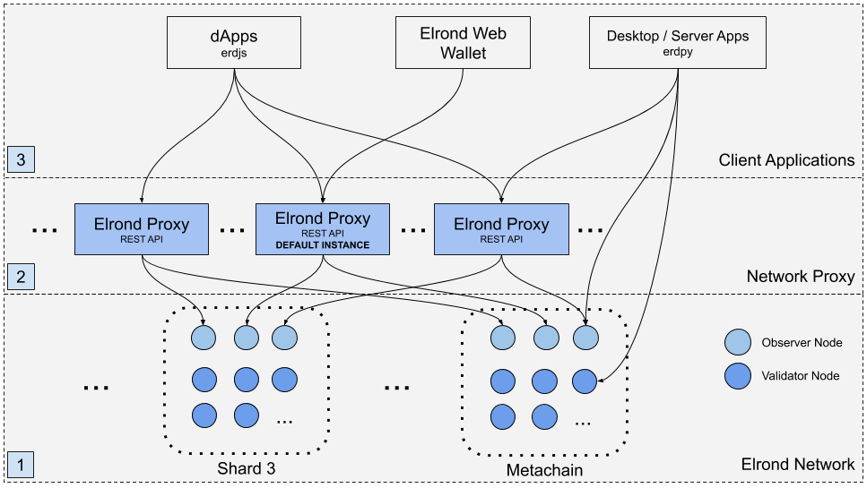

# mx-chain-proxy-go

The **MultiversX Proxy** acts as an entry point into the MultiversX Network. 



For more details, go [here](https://docs.multiversx.com/sdk-and-tools/proxy/).

## Rest API endpoints

# V1.0

### address

- `/v1.0/address/:address`         (GET) --> returns the account's data in JSON format for the given :address.
- `/v1.0/address/:address/balance` (GET) --> returns the balance of a given :address.
- `/v1.0/address/:address/nonce`   (GET) --> returns the nonce of an :address.
- `/v1.0/address/:address/shard`   (GET) --> returns the shard of an :address based on current proxy's configuration.
- `/v1.0/address/:address/keys `   (GET) --> returns the key-value pairs of an :address.
- `/v1.0/address/:address/storage/:key`   (GET) --> returns the value for a given key for an account.
- `/v1.0/address/:address/esdt` (GET) --> returns the account's ESDT tokens list for the given :address.
- `/v1.0/address/:address/esdt/:tokenIdentifier` (GET) --> returns the token data for a given :address and ESDT token, such as balance and properties.
- `/v1.0/address/:address/esdts-with-role/:role` (GET) --> returns the token identifiers for a given :address and the provided role.
- `/v1.0/address/:address/esdts/roles` (GET) --> returns the token identifiers and roles for a given :address
- `/v1.0/address/:address/registered-nfts` (GET) --> returns the token identifiers of the NFTs registered by the given :address.
- `/v1.0/address/:address/esdtnft/:tokenIdentifier/nonce/:nonce` (GET) --> returns the NFT token data for a given address, token identifier and nonce.

### transaction

- `/v1.0/transaction/send`         (POST) --> receives a single transaction in JSON format and forwards it to an observer in the same shard as the sender's shard ID. Returns the transaction's hash if successful or the interceptor error otherwise.
- `/v1.0/transaction/simulate`         (POST) --> same as /transaction/send but does not execute it. will output simulation results
- `/v1.0/transaction/simulate?checkSignature=false`         (POST) --> same as /transaction/send but does not execute it, also the signature of the transaction will not be verified. will output simulation results
- `/v1.0/transaction/send-multiple` (POST) --> receives a bulk of transactions in JSON format and will forward them to observers in the rights shards. Will return the number of transactions which were accepted by the interceptor and forwarded on the p2p topic.
- `/v1.0/transaction/send-user-funds` (POST) --> receives a request containing `address`, `numOfTxs` and `value` and will select a random account from the PEM file in the same shard as the address received. Will return the transaction's hash if successful or the interceptor error otherwise.
- `/v1.0/transaction/cost`         (POST) --> receives a single transaction in JSON format and returns it's cost
- `/v1.0/transaction/:txHash` (GET) --> returns the transaction which corresponds to the hash
- `/v1.0/transaction/:txHash?withResults=true` (GET) --> returns the transaction and results which correspond to the hash
- `/v1.0/transaction/:txHash?withResults=true&relayedTxHash=:relayedTxHash` (GET) --> returns the inner transaction which corresponds to the hash and was part of the relayedTxHash
- `/v1.0/transaction/:txHash?sender=senderAddress` (GET) --> returns the transaction which corresponds to the hash (faster because will ask for transaction from the observer which is in the shard in which the address is part).
- `/v1.0/transaction/:txHash?sender=senderAddress&withResults=true` (GET) --> returns the transaction and results which correspond to the hash (faster because will ask for transaction from observer which is in the shard in which the address is part)
- `/v1.0/transaction/:txHash/status` (GET) --> returns the status of the transaction which corresponds to the hash
- `/v1.0/transaction/:txHash/status?sender=senderAddress` (GET) --> returns the status of the transaction which corresponds to the hash (faster because will ask for transaction status from the observer which is in the shard in which the address is part).

### vm-values

- `/v1.0/vm-values/hex`            (POST) --> receives a VM Request (`scAddress` string, `funcName` string and `args` []string) and returns the result of the VM Query in hex encoded string format
- `/v1.0/vm-values/string`         (POST) --> receives a VM Request (`scAddress` string, `funcName` string and `args` []string) and returns the result of the VM Query in string format
- `/v1.0/vm-values/int`            (POST) --> receives a VM Request (`scAddress` string, `funcName` string and `args` []string) and returns the result of the VM Query in integer format
- `/v1.0/vm-values/query`          (POST) --> receives a VM Request (`scAddress` string, `funcName` string and `args` []string) and returns the result of the VM Query

### network

- `/v1.0/network/status/:shard`      (GET) --> returns the status metrics from an observer in the given shard
- `/v1.0/network/config`             (GET) --> returns the configuration of the network from any observer
- `/v1.0/network/economics`          (GET) --> returns the economics data metric from the last epoch
- `/v1.0/network/esdts`              (GET) --> returns the names of all the issued ESDTs
- `/v1.0/network/direct-staked-info` (GET) --> returns the list of direct staked values
- `/v1.0/network/delegated-info`     (GET) --> returns the list of delegated values
- `/v1.0/network/enable-epochs`      (GET) --> returns the activation epochs metric
### node

- `/v1.0/node/heartbeatstatus`     (GET) --> returns the heartbeat data from an observer from any shard. Has a cache to avoid many requests

### validator

- `/v1.0/validator/statistics`     (GET) --> returns the validator statistics data from an observer from any shard. Has a cache to avoid many requests
- `/v1.0/validator/auction`        (GET) --> returns the validator auction list data from an observer from metachain. It doesn't have a cache mechanism, since there is already one in place at the node level

### block

- `/v1.0/block/:shardID/by-nonce/:nonce`    (GET) --> returns a block by nonce
- `/v1.0/block/:shardID/by-nonce/:nonce?withTxs=true`    (GET) --> returns a block by nonce, with transactions included
- `/v1.0/block/:shardID/by-hash/:hash`    (GET) --> returns a block by hash
- `/v1.0/block/:shardID/by-hash/:hash?withTxs=true`    (GET) --> returns a block by hash, with transactions included
- `/v1.0/block/:shardID/altered-accounts/by-nonce/:nonce`    (GET) --> returns altered accounts in the given block by nonce
- `/v1.0/block/:shardID/altered-accounts/by-nonce/:nonce?tokens=token1,token2`    (GET) --> returns altered accounts in the given block by nonce, filtered out by given tokens
- `/v1.0/block/:shardID/altered-accounts/by-hash/:hash`    (GET) --> returns altered accounts in the given block by hash
- `/v1.0/block/:shardID/altered-accounts/by-hash/:hash?tokens=token1,token2`    (GET) --> returns altered accounts in the given block by hash, filtered out by given tokens

Please note that `altered-accounts` endpoints will only work if the backing observers of the Proxy have support for historical balances (`--operation-mode historical-balances` when starting the node)

### blocks

- `/v1.0/blocks/by-round/:round`    (GET) --> returns all blocks by round

### hyperblock

- `/v1.0/hyperblock/by-nonce/:nonce`  (GET) --> returns a hyperblock by nonce, with transactions included
- `/v1.0/hyperblock/by-nonce/:nonce?withAlteredAccounts=true`  (GET) --> returns a hyperblock by nonce, with transactions and altered accounts in each notarized block. Other available query parameters are `&tokens=token1,token2` as described in the `block` section above
- `/v1.0/hyperblock/by-hash/:hash`    (GET) --> returns a hyperblock by hash, with transactions included
- `/v1.0/hyperblock/by-hash/:hash?withAlteredAccounts=true`  (GET) --> returns a hyperblock by hash, with transactions and altered accounts in each notarized block. Other available query parameters are `&tokens=token1,token2` as described in the `block` section above

# V_next

This serves as a placeholder for further versions in order to provide a real use-case example of how performing
CRUD operations over endpoints works.
What is different from `v1_0`:
- `/v_next/address/:address/shard` is updated and returns a hardcoded `37` as shard ID
- `/v_next/address/:address/new-endpoint` is added a returns a hardcoded `"test"` as data field
- `/v_next/address/:address/nonce` is removed

The rest of endpoints remain the same.

## Faucet
The faucet feature can be activated and users calling an endpoint will be able to perform requests that send a given amount of tokens to a specified address.

In order to use it, first set the `FaucetValue` from `config.toml` to a value higher than `0`. This will activate the feature. Then, provide a `walletKey.pem` file near `config.toml` file. This will make the `/transaction/send-user-funds` endpoint available.


## build docker image
```
 docker image build . -t chain-proxy-local -f ./docker/Dockerfile
```

## run proxy with docker
```
docker run -p 8080:8080 chain-proxy-local --log-level "*:DEBUG" 
```
